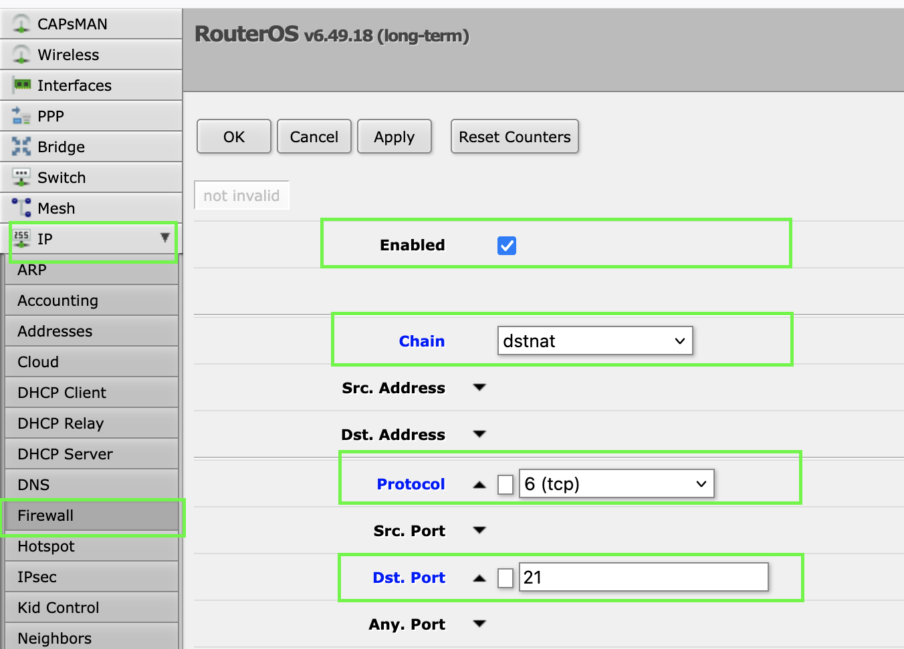
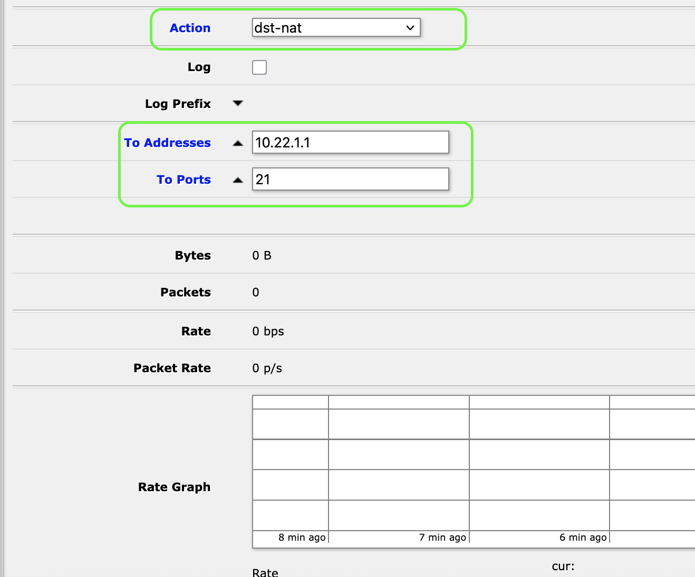

# How to Port Forward FTP on MikroTik Router

Port forwarding FTP on a MikroTik router allows external users to access an internal FTP server. This guide explains how to forward port **21** (default for FTP) to an internal machine using **Winbox/WebFig** or **CLI**.

---

## 🛠 Requirements

- MikroTik router with access to the internet
- Internal FTP server (e.g., 10.22.1.1)
- Administrator access to MikroTik (Winbox or Terminal)

---

## ⚙️ Step-by-Step: Port Forwarding FTP (Port 21)

### 1. Open Winbox or WebFig

Navigate to:

```
IP → Firewall → NAT
```

Click the **"+"** button to add a new rule.

### 2. General Tab

- **Chain:** `dstnat`
- **Protocol:** `tcp`
- **Dst. Port:** `21`

### 3. Action Tab

- **Action:** `dst-nat`
- **To Addresses:** `10.22.1.1` *(your internal FTP server)*
- **To Ports:** `21`



Click **OK** to save.

---

## 🔒 Passive Mode Considerations

If your FTP server uses **passive mode**, you also need to forward the passive port range (e.g., 50000–50100). Add another NAT rule:

- **Protocol:** `tcp`
- **Dst. Port:** `50000-50100`
- **Action:** `dst-nat`
- **To Address:** `10.22.1.1`

---

## 🧠 Enable FTP Helper (Optional but Recommended)

The MikroTik FTP connection tracking helper assists with passive FTP connections.

To verify it's enabled:

```
/ip firewall service-port print
```

Ensure the `ftp` service is listed and `enabled=yes`.

---

## ✅ Test Your FTP Server

From an external network:

```
ftp your-public-ip
```

Or use an FTP client like **FileZilla**, connecting to:

- **Host:** `your-public-ip`
- **Port:** `21`
- **Username/Password:** (as configured on your FTP server)

---

## 📝 Notes

- Ensure your internal firewall (on the FTP server) allows FTP traffic.
- Avoid using the default port (21) publicly if possible — consider port mapping for security.

---

## 📌 Example: CLI Commands

```
/ip firewall nat add chain=dstnat protocol=tcp dst-port=21 action=dst-nat to-addresses=10.22.1.1 to-ports=21
/ip firewall nat add chain=dstnat protocol=tcp dst-port=50000-50100 action=dst-nat to-addresses=10.22.1.1
```

---

## 🎉 Done!

Your MikroTik router should now forward FTP traffic correctly to your internal server.