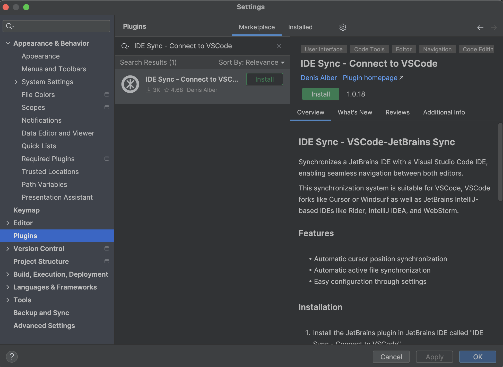
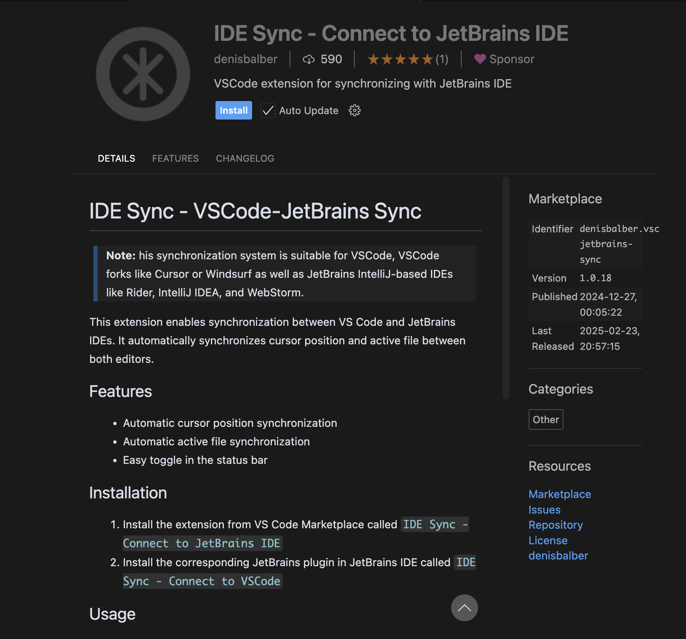
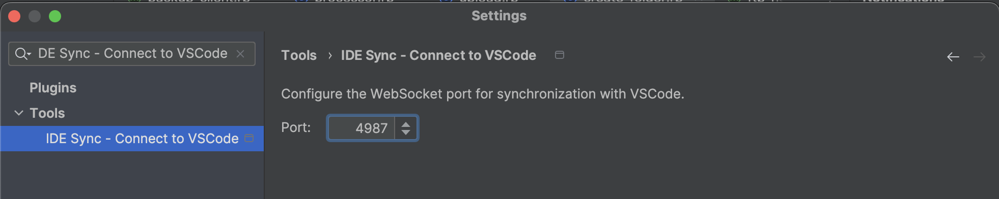
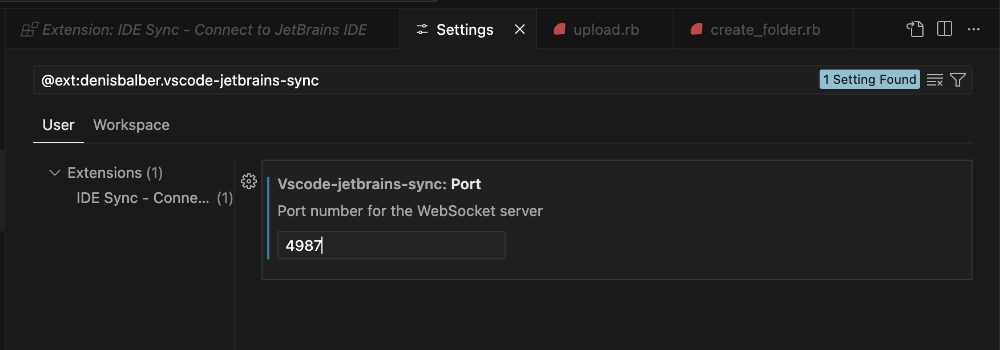

## RubyMine and Cursor AI Synchronization

At the time of writing, AI integration in RubyMine is still lacking.  
As a workaround, we can use two tools in tandem:

1. **RubyMine** – a powerful and full-featured IDE
2. **Cursor AI** – an additional editor enhanced with AI capabilities

To make this setup efficient, it would be great to synchronize these tools.  
For example, when we open a file in RubyMine, the same file could also be opened automatically in Cursor AI.

That sounds like a great solution — why not give it a try?

### How to implement this approach:

1. Install the **JetBrains plugin** in your JetBrains IDE called  
   **"IDE Sync – Connect to VSCode"**

2. Install the corresponding **VS Code extension** called  
   **"IDE Sync – Connect to JetBrains IDE"**

This way, you can continue using RubyMine for its strong IDE features while leveraging Cursor AI's advanced code suggestions and AI integrations in parallel.

### ⚠️ Port Conflict Note

These plugins work via **WebSocket** and use port **3000** by default.

In my case, this port was already in use by my local **Ruby on Rails** application.

So, I had to change the plugin port to another one.  
For example, I changed it to **4987**.

Make sure to update the port in both:

- the **JetBrains plugin settings**

- the **VS Code extension settings**
