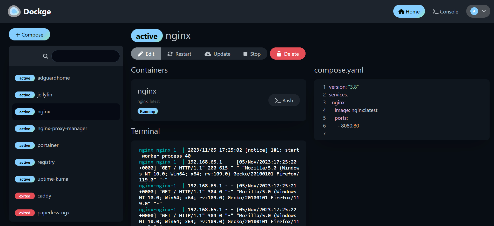

# Dockge – Beautiful, Fancy, Easy-to-Use Docker Compose Manager


### Dockge – Beautiful, Fancy, Easy-to-Use Docker Compose Manager


Today I discovered a fantastic tool for managing my Docker containers based on docker-compose.yml files — it’s called [Dockge](https://dockge.kuma.pet/).

Dockge isn’t just another wrapper around Docker — it genuinely impressed me. It has a beautiful, modern interface, works fast, and most importantly, makes it super easy to start, stop, and monitor services in a stack. Some highlights:



- Fully self-hosted — I just added it as a service in my existing docker-compose.yml.

- Supports multiple stacks and lets you switch between them effortlessly.
- 
- Displays logs, statuses, ports, and even lets you edit files directly from the UI.

It’s exactly what I’ve been missing for managing several projects — each with their own setup of Redis, Postgres, Sidekiq, web servers, and more.

If you’re managing multiple containers and tired of running docker compose ps, logs, up -d all the time in the terminal — give Dockge a try. It might just become your new favorite DevOps tool.

[Official web page](https://dockge.kuma.pet/)

[Github](https://github.com/louislam/dockge)

### My custom config

```dockerfile
services:
  dockge:
    image: louislam/dockge:1
    restart: unless-stopped
    ports:
      # Host Port : Container Port
      - 5001:5001
    volumes:
      - /Users/savio/.docker/run/docker.sock:/var/run/docker.sock
      - /Users/savio/#_Docker/dockge/data:/app/data
        
      # If you want to use private registries, you need to share the auth file with Dockge:
      # - /root/.docker/:/root/.docker

      # Stacks Directory
      # ⚠️ READ IT CAREFULLY. If you did it wrong, your data could end up writing into a WRONG PATH.
      # ⚠️ 1. FULL path only. No relative path (MUST)
      # ⚠️ 2. Left Stacks Path === Right Stacks Path (MUST)
      - /Users/savio/#_Docker/dockge/stacks:/opt/stacks
    networks:
     - shared
    environment:
      # Tell Dockge where is your stacks directory
      - DOCKGE_STACKS_DIR=/opt/stacks
networks:
 shared:
  external: true
```
